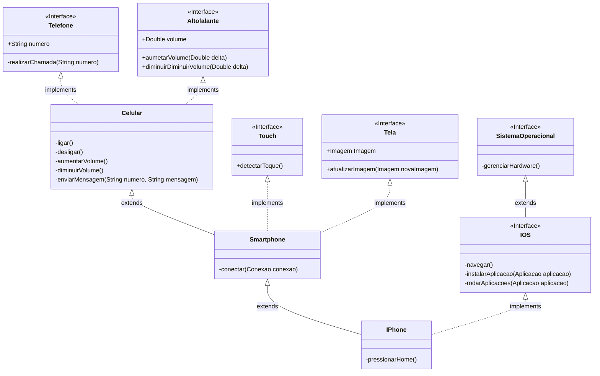

# desafio-uml

Desafio de modelar o IPhone com UML

```mermaid
classDiagram
    class Telefone {
        <<Interface>>
        +String numero
        -realizarChamada(String numero)
    }

    class Altofalante {
        <<Interface>>
        +Double volume
        +aumetarVolume(Double delta)
        +diminuirDiminuirVolume(Double delta)
    }

    class Touch {
        <<Interface>>
        +detectarToque()
    }

    class Tela {
        <<Interface>>
        +Imagem Imagem
        +atualizarImagem(Imagem novaImagem)
    }

    class SistemaOperacional {
        <<Interface>>
        -gerenciarHardware()
    }

    class IOS {
        <<Interface>>
        -navegar()
        -instalarAplicacao(Aplicacao aplicacao)
        -rodarAplicacoes(Aplicacao aplicacao)
    }

    class Celular {
        -ligar()
        -desligar()
        -aumentarVolume()
        -diminuirVolume()
        -enviarMensagem(String numero, String mensagem)
    }

    class Smartphone {
        -conectar(Conexao conexao)
    }

    class IPhone {
        -pressionarHome()
    }

    Telefone <|.. Celular : implements
    Altofalante <|.. Celular : implements
    Celular <|-- Smartphone : extends
    Touch <|.. Smartphone : implements
    Tela <|.. Smartphone : implements
    Smartphone <|-- IPhone : extends
    SistemaOperacional <|-- IOS : extends
    IOS <|.. IPhone : implements
```
